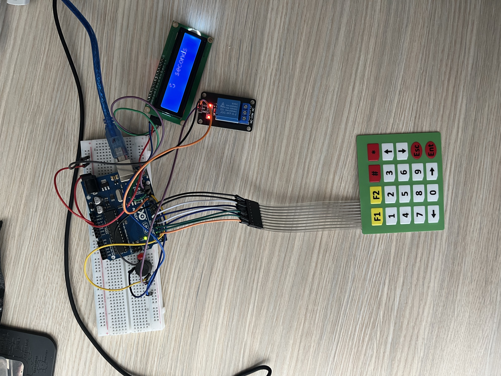

# Arduino Safe/Locker Project

## Overview
This Arduino project implements a simple safe/locker system using a keypad, LCD display, LED, relay, and a buzzer. Users can input a password through the keypad, and based on the correctness of the password, the system will either open the "safe" or trigger an alarm.

## Features
- Input password via keypad
- Display text on an LCD display
- LED and relay activation upon correct password entry
- Alarm (red LED and buzzer) upon incorrect password entry
- Countdown timer after 3 unsuccessful attempts
- Password change functionality with automatic EEPROM storage

## Components Used
- Arduino Uno Board
- Keypad
- LCD Display
- Green LED (for successful attempt)
- Red LED (for unsuccessful attempt)
- Buzzer (for alarm)
- Relay (to simulate safe opening)
- EEPROM (for password storage)

## Wiring
Include a wiring diagram or textual description of how the components are connected to the Arduino.

## Installation
1. Clone the repository: `git clone https://github.com/your-username/arduino-safe-project.git`
2. Open the Arduino IDE.
3. Load the project file.
4. Connect your Arduino to the computer.
5. Upload the code to your Arduino board.

